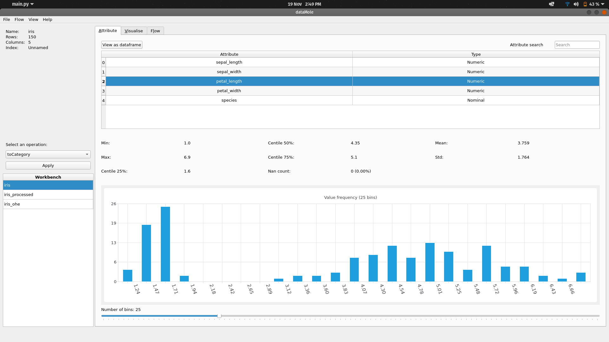
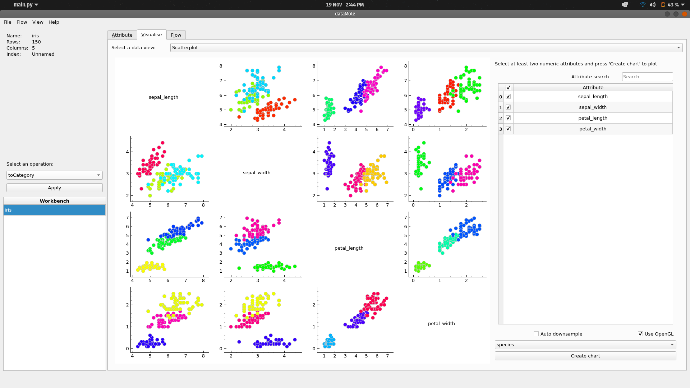
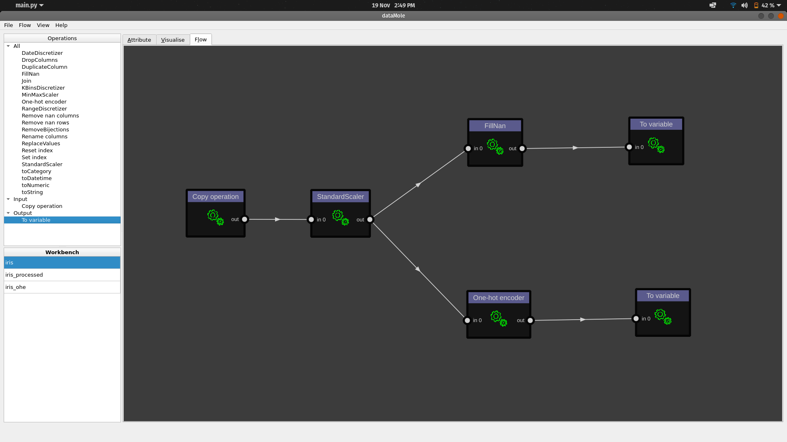

# DataMole <!-- omit in toc -->

A Qt-based graphical tool for processing and exploring tabular datasets (CSV) in machine learning and
 data analysis projects.
 
Note that `DataMole` is still experimental and under development.

## Table of Contents <!-- omit in toc -->
- [Features](#features)
  - [Screenshots](#screenshots)
- [Installation](#installation)
- [Software usage](#software-usage)
- [Developer info](#developer-info)
  - [Building documentation with Sphinx](#building-documentation-with-sphinx)
- [Credits](#credits)

## Features

- Import and export CSV dataset
- Apply transformations using the graphical interface:
    - Fill missing values
    - Replace values
    - Discretize numeric columns or datetimes attributes
    - Scale columns
    - One-hot encode
    - Add/remove columns
    - Join two tables
    - Convert types (e.g. numeric -> string)
    - Extract time series information from longitudinal datasets
- Draw scatterplots and line charts for time series
- Get data statistics (histogram, mean, std, etc.)
- Create pipelines of transformations and execute them
- Import and export pipelines (in `pickle`)

### Screenshots

## Installation

1. Install Python >= 3.8.0
2. Open a terminal. On Windows 10 use the Windows PowerShell
3. Create a virtualenv (*):
    - Install virtualenv: `python -m pip install virtualenv`
    - Move in the main `dataMole` folder (the one with `main.py`)
    - Create a virtualenv: `python -m virtualenv venv`
    - Activate it: `source ./venv/bin/activate` (`.\venv\Scripts\Activate.ps1` on Windows)
4. With the active virtualenv, install dependencies: `python -m pip install -r requirements.txt`
5. Generate Qt resources: `make resources` (**)
6. Start software with `python main.py`

(*) Of course you can just use the global Python installation if you are ok with that (not recommended)

(**) On Windows `make` command does not work, so the command to give at step 5 is:
- `pyside2-rcc dataMole/resources.qrc -o dataMole/qt_resources.py`

This will generate a new file `qt_resources.py`.

## Software usage
Refer to the user manual in `docs/manuals`

## Developer info
In addition to the packages listed in `requirements.txt` you may want to install the ones listed in `requirements.dev.txt`.

Refer to the developer manual in `docs/manuals` for information about software architecture and on how to extend it.
 
Manuals `.tex` source files are in `docs/manuals/source` folder.

### Building documentation with Sphinx

1. Move into the `docs` folder
2. Generate stubs (rst) if required: `make stubs`
3. Generate documentation:
    - `make html` for html documentation
    - `make pdf` to convert the documentation in a single pdf file

The output will be found in the `auto/build` directory.

Use `make clean` to remove the build directory.

## Credits

Here is a list of third party software used within this project.

- [dsideb/nodegraph-pyqt](https://github.com/dsideb/nodegraph-pyqt): an interactive DAG visualization tool built in PySide/PyQt, licensed under GNU GPL-3.0;
- [z3ntu/QtWaitingSpinner](https://github.com/z3ntu/QtWaitingSpinner): configurable Qt widget for showing a waiting spinner, with MIT license.